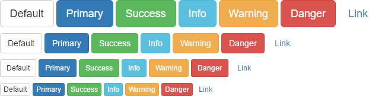

Anyone that has created a website in the last decade has probably benefitted from the effortless responsiveness and styling that front-end UI kits like Bootstrap and Foundation are capable of providing. A convenience that has led to their pervasive use across the internet, though many are finding that these conveniences can quickly begin to feel like a pair of golden handcuffs.
In spite of touting boundless customization and extendability, in most cases the component creation within these UI kits have developed a level of abstraction that encourages developers to reuse provided components with minimal modification. As such, it always feels like you inevitably end up with a website that resembles [every bootstrap website ever](https://www.dagusa.com/). Now that's not to say that there aren't benefits of having a website that feels intuitive and familiar enough that users are able to navigate it with ease, but it is possible to create buttons that are easily distinguishable, without looking like this:

  

So isn't there a way to get the same convenient responsiveness, without your website looking like a clone or template? Enter [TailwindCSS](https://tailwindcss.com/).

## What is TailwindCSS?  
Tailwind CSS bills itself as a utility-first CSS framework for rapidly building custom user interfaces. Though I often see it as a way of getting a lot of the convenience and responsiveness of a UI kit, without having your design limited by opinionated components and styling.  

### 1. Installation  
As you'd expect, TailwindCSS is readily available via npm, and can be installed with the following command:  
```sh
$ npm install tailwindcss --save-dev
```

### 2. Configuration  
Adhering to it's 'utility-first' descriptor, TailwindCSS doesn't offer any prestyled components and instead chooses to provide a wealth of utility classes for creating and styling your own components. Additionally, providing the ability to create a configuration file that makes it easy to define your own color palettes and custom utility classes, which can be initialized with the following command:  
```sh
$ npx tailwind init [filename]
```
